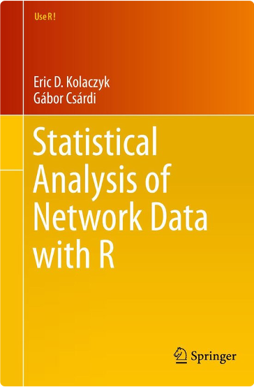
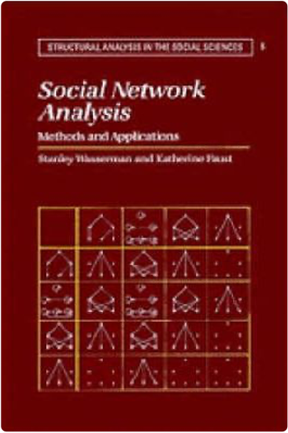
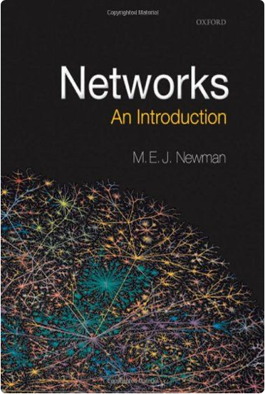

### Useful websites to get started with graph/network theory

- [d3 graph theory](https://d3gt.com/index.html) : 💥 Interactive and colorful 🎨 graph theory tutorials made using d3.js ⚡ 
- [network science book](http://networksciencebook.com/) : 🖥 online version  🖥 of the Loscalzo, J., & Barabási, A. L. (2016). "Network science" book

### Useful tutorials for getting started with graph/network analysis and visualisation in R & Python

- [Network analysis with R starting point](/basic_igraph.R) to get acquainted with igraph/R (taken from a workshop created by Ognyanova, K 👇)
- [Network analysis with R workshop](https://kateto.net/wp-content/uploads/2018/03/R%20for%20Networks%20Workshop%20-%20Ognyanova%20-%202018.pdf)
- [Network visualization with R](https://kateto.net/network-visualization)  by Ognyanova, K. (2019)
- [Social Network Analysis with Python and NetworkX](/NetworkX_SNA_workshop.ipynb) a Python/NetworkX workshop from Pydata_BCN
- [Network-Analysis-Made-Simple](https://ericmjl.github.io/Network-Analysis-Made-Simple/) yet another great tutorial

### Useful intermediate books for graph/network theory

<a href="https://www.springer.com/gp/book/9781493909834"> <a href="https://www.cambridge.org/core/books/social-network-analysis/90030086891EB3491D096034684EFFB8"><a href="https://global.oup.com/academic/product/networks-9780198805090?cc=gb&lang=en&">

### Terminology

Like any discipline, graphs/networks come with their own set of nomenclature. 
The following descriptions are intentionally simplified—more mathematically rigorous definitions can be found in any graph theory textbook.

`Graph/Network` 

    — A data structure G = (V, E) where V and E are a set of vertices/nodes and edges.

`Vertex/Node` 

    — Represents a single entity such as a person or an object,

`Edge` 

    — Represents a relationship between two vertices (e.g., are these two vertices friends on a social network?).

`Directed Graph vs. Undirected Graph` 

    — Denotes whether the relationship represented by edges is symmetric or not 

`Weighted vs Unweighted Graph` 

     — In weighted graphs edges have a weight that could represent cost of traversing or a similarity score or a distance score

     — In unweighted graphs edges have no weight and simply show connections . example: course prerequisites

`Subgraph` 

    — A set of vertices and edges that are a subset of the full graph's vertices and edges.

`Degree` 
    
    — A vertex/node measurement quantifying the number of connected edges 

`Connected Component` 

    — A strongly connected subgraph, meaning that every vertex can reach the other vertices in the subgraph.

`Shortest Path` 
    
    — The lowest number of edges required to traverse between two specific vertices/nodes.

